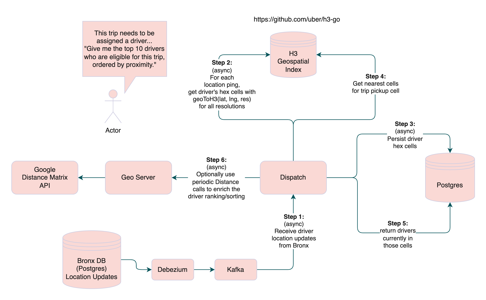

# api-geo-h3
This is a proof-of-concept component that wraps [H3](https://h3geo.org/),
a hexagonal hierarchical geospatial indexing system.

This service needs to have the following capabilities:
* [`geoToH3`](https://h3geo.org/docs/api/indexing/#geotoh3) — convert lat/lng to hex cell (step 2)
* [`kRing`](https://h3geo.org/docs/api/traversal/#kring) — get a cell's neighboring cells (step 4)
* [`h3ToParent`](https://h3geo.org/docs/api/hierarchy#h3toparent) — get a cell's coarser parent (zoom out)
* [`h3ToChildren`](https://h3geo.org/docs/api/hierarchy#h3tochildren) — get a cell's children (zoom in)

